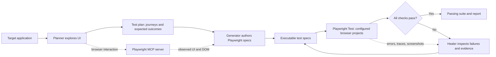

# Playwright Agents Workspace

This workspace is for using the **Playwright Planner, Generator, and Healer** together to build and maintain browser tests. The Nova Shop suite is the working example: Planner explores the app and creates a test plan, Generator turns the plan into Playwright specs, and Healer diagnoses and repairs failing tests.

[Nova Shop](https://www.practiceqaautomation.com/shop) is a public e-commerce practice app from PracticeQAAutomation. This project tests its hosted UI with Playwright Test; it does not contain the application itself.

**Coverage:** sign-in · product discovery · cart and coupons · checkout · order history  
**Active browser project:** Chromium. Firefox and WebKit projects are defined but currently commented out.

## Agent Workflow

The project follows a plan → generate → run → heal loop. Browser observations and test results are the evidence passed between stages:



| Agent | Inputs | Responsibilities | Output |
| --- | --- | --- | --- |
| **Planner** | Target URL, user goals, browser observations | Explore the UI; identify user journeys, meaningful edge cases, and observable outcomes | A reviewable test plan in `specs/` |
| **Generator** | Approved plan, observed controls and DOM, project conventions | Turn scenarios into maintainable Playwright specs using grounded locators and web-first assertions | Runnable specs in `tests/` |
| **Healer** | Failing test output, error context, traces, screenshots, current spec | Classify locator, assertion, timing, or environment failures; make the smallest test correction and rerun | Repaired specs and verified test results |

### Handoff Checks

1. **Plan → Generator:** each scenario has a clear starting state, user action, and observable expected result. Keep test data and negative paths explicit.
2. **Generator → Playwright:** locators should come from accessible roles, labels, or inspected stable test IDs. Validate selectors against the rendered DOM; avoid guessing hidden control IDs.
3. **Playwright → Healer:** use the first failing assertion and attached browser evidence to identify the cause. Distinguish a test defect from a real application regression before changing expectations.
4. **Healer → Runner:** rerun the focused test after a fix, then run the full browser matrix to check for cross-browser regressions.

The Planner, Generator, and Healer are provided by the VS Code Playwright Agents environment; this repository contains the target-specific plan and tests, not implementations of those agents. The Playwright MCP server used for browser interaction is configured in [`.vscode/mcp.json`](.vscode/mcp.json).

In this workspace, the plan is [`specs/nova-shop-core-operations.plan.md`](specs/nova-shop-core-operations.plan.md), and the five scenario specs live directly in `tests/`.

## Quick Start

Prerequisites: Node.js (LTS recommended) and npm.

```bash
npm ci
npx playwright install
cp .env.example .env
npm run test:qa
```

Add the selected environment's passwords to `.env` before running tests. `.env` is ignored by Git. The suite uses the hosted application, so a local application server is not required. An internet connection is required when tests run.

On Linux CI, install browser system dependencies with:

```bash
npx playwright install --with-deps
```

## Run Tests

Run the full suite against QA or stage:

```bash
npm test
npm run test:qa
npm run test:stage
```

Run a single browser project or one scenario:

```bash
npm run test:chromium
npm run test:firefox
npm run test:webkit
npm run test:qa:chromium
npm run test:stage:chromium
npx playwright test tests/checkout.spec.ts
```

The Firefox and WebKit scripts are prepared, but those browser projects must be uncommented in `playwright.config.ts` before use; Chromium is the only active project today.

Open the interactive runner or run a visible browser:

```bash
npm run test:ui
npm run test:headed
npm run test:list
```

After a run, open the HTML report:

```bash
npm run report
```

## Example Suite

The Nova Shop tests demonstrate the artifacts produced and maintained through the Planner → Generator → Healer workflow.

| Scenario | Spec | Main behaviors |
| --- | --- | --- |
| Sign-in and session | [`tests/sign-in-session.spec.ts`](tests/sign-in-session.spec.ts) | Empty credentials, locked account, successful login, logout |
| Product discovery | [`tests/product-discovery.spec.ts`](tests/product-discovery.spec.ts) | Search, category and availability filters, sorting, product details |
| Cart and coupons | [`tests/cart-coupon.spec.ts`](tests/cart-coupon.spec.ts) | Variant selection, quantity changes, invalid and valid coupons, removal |
| Checkout | [`tests/checkout.spec.ts`](tests/checkout.spec.ts) | Required-field validation, express shipping, declined card, COD order |
| Order history | [`tests/order-history.spec.ts`](tests/order-history.spec.ts) | Place an order, inspect its record, verify persistence after reload |

The written test plan is available at [`specs/nova-shop-core-operations.plan.md`](specs/nova-shop-core-operations.plan.md).

## Configuration

Playwright configuration lives in [`playwright.config.ts`](playwright.config.ts):

- `testDir` points to `tests/`.
- `TEST_ENV=qa` selects QA; this defaults to the public Nova Shop URL unless `QA_BASE_URL` overrides it.
- `TEST_ENV=stage` selects staging and requires `STAGE_BASE_URL`.
- Dotenv loads local `.env` values before configuration; CI can provide variables directly.
- `use.baseURL` is resolved from the selected environment in `test-data/shopTestData.ts`.
- Chromium is the only active project; Firefox and WebKit definitions are currently commented out.
- Tests run in parallel by default. In CI, retries are enabled and worker count is limited to one.
- Traces are collected on the first retry.

Each test performs its own login and shopping setup in its isolated browser context. Shop-specific Page Objects are in `pages/shop/`, reusable Playwright fixtures are in `fixtures/`, and shared test data is in `test-data/`.

## Environments and Credentials

Environment-specific passwords are read from process environment and are required. Usernames default to the public demo account names but can be overridden. For local use, copy [`.env.example`](.env.example) to `.env` and fill in the passwords. Dotenv loads `.env` when Playwright starts, and `.env` is ignored by Git. In CI, set the same variables using the platform's secret store. Never put passwords in source files, npm scripts, or committed config.

| Variable | Purpose |
| --- | --- |
| `TEST_ENV` | `qa` or `stage`; defaults to `qa` |
| `QA_BASE_URL` | Optional QA base URL; defaults to `https://www.practiceqaautomation.com/shop` |
| `STAGE_BASE_URL` | Required stage base URL |
| `QA_STANDARD_PASSWORD` / `STAGE_STANDARD_PASSWORD` | Standard test-account password for the selected environment |
| `QA_LOCKED_PASSWORD` / `STAGE_LOCKED_PASSWORD` | Locked test-account password for the selected environment |
| `QA_STANDARD_USERNAME` / `STAGE_STANDARD_USERNAME` | Optional standard username override |
| `QA_LOCKED_USERNAME` / `STAGE_LOCKED_USERNAME` | Optional locked username override |

For QA, set the two `QA_*_PASSWORD` values before running `npm run test:qa`. For stage, set `STAGE_BASE_URL`, `STAGE_STANDARD_PASSWORD`, and `STAGE_LOCKED_PASSWORD` before running `npm run test:stage`. In CI, configure these values as protected secrets/variables. `cross-env` lets the npm scripts select `TEST_ENV` consistently across Windows, macOS, and Linux.

The demo's declined-payment test card is a public sandbox value, not a real payment credential.

## Project Layout

```text
.
├── .github/
│   ├── agents/                 # Local Planner, Generator, and Healer instructions
│   └── workflows/              # GitHub Actions workflows
├── .vscode/
│   └── mcp.json                # Playwright MCP server configuration
├── .env.example
├── docs/
│   └── ENVIRONMENTS.md         # QA/stage URLs and credential setup
├── fixtures/
│   └── shop.fixture.ts         # Per-test Page Object fixtures
├── pages/
│   └── shop/                   # Page Objects and reusable UI actions
│       ├── CartPage.ts
│       ├── CheckoutPage.ts
│       ├── LoginPage.ts
│       ├── OrderConfirmationPage.ts
│       ├── OrdersPage.ts
│       ├── ProductDetailsPage.ts
│       ├── ProductsPage.ts
│       └── ShopPage.ts
├── playwright.config.ts
├── specs/
│   ├── README.md
│   └── nova-shop-core-operations.plan.md
├── test-data/
│   └── shopTestData.ts         # Environment selection, credentials, and scenario data
├── tests/                      # Executable end-to-end scenarios
│   ├── cart-coupon.spec.ts
│   ├── checkout.spec.ts
│   ├── order-history.spec.ts
│   ├── product-discovery.spec.ts
│   └── sign-in-session.spec.ts
├── package.json
└── package-lock.json
```

The boundaries are intentional: scenarios live directly in `tests/`; selectors and reusable UI actions live in `pages/`; test setup is composed in `fixtures/`; environment-specific values and scenario data are centralized in `test-data/`; plans and environment instructions stay outside Playwright's test discovery tree.

## Reliability Notes

- The target is an external practice site. A site outage, network issue, or intentional catalog change can affect results independently of this test project.
- Never commit `.env` files or real passwords. Local `.env` files are excluded by `.gitignore`; use CI secret storage for pipeline runs.
- Cart and order data are stored by the demo in browser `localStorage`. Playwright gives each test a separate browser context by default, keeping the scenarios isolated.
- Prefer accessible roles and labels or the app's stable `data-testid` attributes. Some visually hidden radio inputs are best activated through their visible wrapping labels.
- Avoid assertions that depend on generated order numbers or dates being constant; capture generated values from the confirmation and compare them with the corresponding history entry.

## Artifacts

Playwright writes test results to `test-results/` and the HTML report to `playwright-report/`. These generated directories are excluded from Git by [`.gitignore`](.gitignore).
